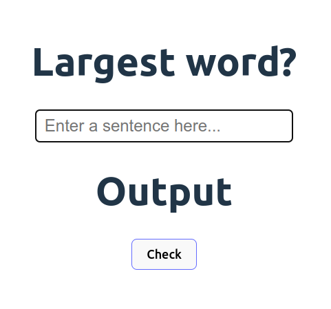
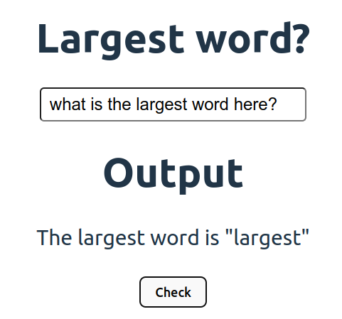

# Whats the largest word

This app will help you find the largest word in any sentence you provide.
The main focus of the project is to code the logic behind this app.

## MVP

To be considered complete this project must include the following:

- Basic css styling to make it presentable
- An input field to accept input from user
- A button to check the largest word
- And fully functional logic that correctly finds the largest word

## Project Reflection

After completing this project I have learned following things:

- I don't need to break down simple straightforward functions
- Learned to use array methods
- Learned to use this to find largest num in an array:  
- `Math.max.apply(Math, arrOfCharNum)`

## Screenshot

